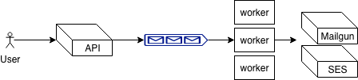

# limbo

## Architecture

High-level architecture drawing



This repository contains two high level elements, one `api` and `workers`.
Overall the design is based on handling a few things.

- Separation of submitting emails and sending them, but queueing messages that
  have been submitted, scaling now becomes a thing around either scaling to more
  workers, which then would process messages on the queue faster or scaling the
  api, so more messages can be submitted.
- If one worker dies, there can be reacted promptly for spinning up more
  workers, this of course also means that the api can do the same (The `api`
  should be behind a loadbalancer)

By using this design, there is also introduced aynchronious communication
between the user and the services, which means at the moment the only response
the user actually gets, is whether or not the message has been submitted to the
queue. This could, as part of future work, be handled by keeping a log of all
request for every user together with having a authentication for users, so the
communication between `api` and user is possible even after finished request.

With the design in mind, there is a consideration in actually stopping
interacting with the user, so the only thing the user actually knows is that the
message is queued. Another consideration is that this implementation clearly
uses elements from AWS, which now create a thightly couple design between the
service and AWS. 

Further considerations should also be made on have more mail handlers is
introduced, at the moment it is one single implementation file per handler, and
already this gives some common implementation details between the handlers.

Finally monitoring and maybe even tracing would be the next logical step for
guaranteeing production stability, especially regarding user requests, but also
for identifying how workers operate. 

### Api

`api` handles web request from a user, that wants to send emails, endpoints is
defined as in API further down. For every request received the `api` handles
submitting every message to an queue, which at the moment is FIFO sqs queue on
aws. 

### Workers

`workers` is polling sqs for messages and for every message it handles sending
the email. For one worker it, at the moment, contains two implementations; one
which uses AWS SES and another using Mailgun.

## Dependencies

Limbo makes use of

- AWS SQS
- AWS SNS
- Mailgun

The rest of the dependencies are defined as part of Pipfile

## Environment values

```quote
QUEUE=<sqs queue>
DEADLETTERQUEUE=<deadletter sqs queue>
REGION=<aws region>
SESSOURCE=<email used for ses>
MAILGUN=<mailgun api key>
DOMAIN=<mailgun domain>
```

## Testing

For executing test, please run
```bash
python -m unittest
```

## API

### Root

Returning a small hello world

**Definition**

`GET /`

**Response**
- `200 OK` on success

```json
{
    "hello": "world"
}
```

### Health

Returning ok for representing the service is up and alive.

**Definition**

`GET /health`

**Response**
- `200 OK` on success

```json
{
    "health": "ok"
}
```

### Metrics

Returning metrics about the service

**Definition**

`GET /metrics`

**Response**
- `200 OK` on success

```json
{
    "metrics": "ok"
}
```

### Mail

Submit of emails to the service

**Definition**

`POST /v1/mail`

**Request Body**

| Key | Value type | Description | Param |
| --- | --- | --- | --- |
| from | string | email address for the sender | required |
| to | list of strings | list of emails that should recieve the message | required |
| cc | list of strings | list of emails that should be cc on the message | optional |
| bcc | list of strings | list of emails that should be bcc on the message | optional |
| subject | string | subject of the message | required |
| message | string | contents of the message | required |

```json
{
    "from": "email@email.com",
    "to": ["email@email.com", "email@email.com"],
    "cc": ["email@email.com"],
    "subject": "Hello",
    "message": "World!",
}
```

**Response**
- `200 OK` on success

```json
{
    "Message": "submitted"
}
```

**Response**
- `400 Bad Request` on failure

```json
{
    "Message": "not submitted",
    "Problem": <description of problem>
}
```
